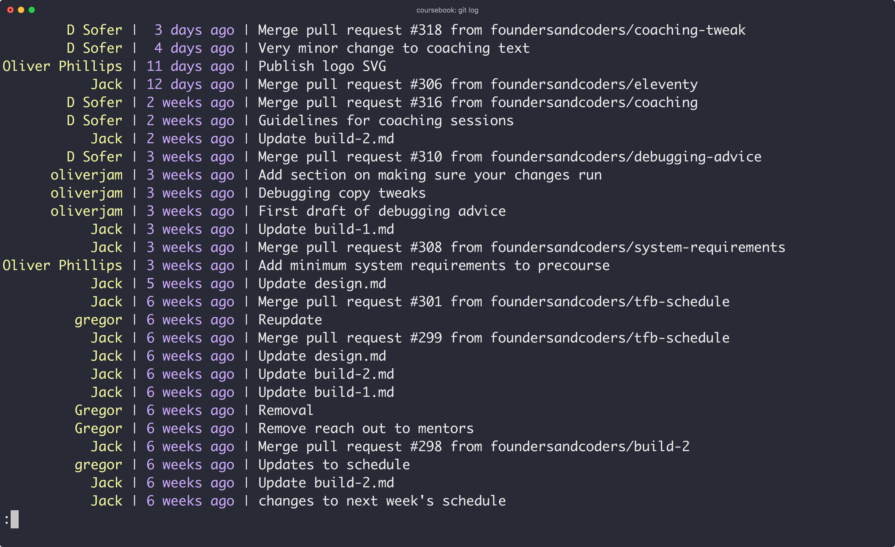
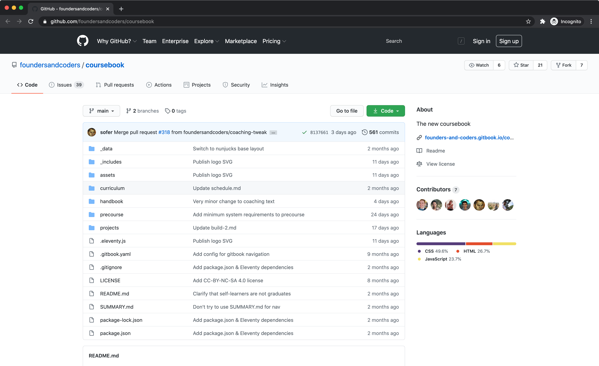
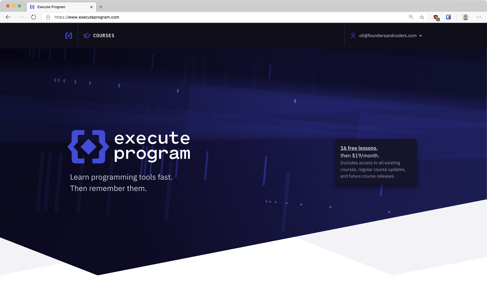
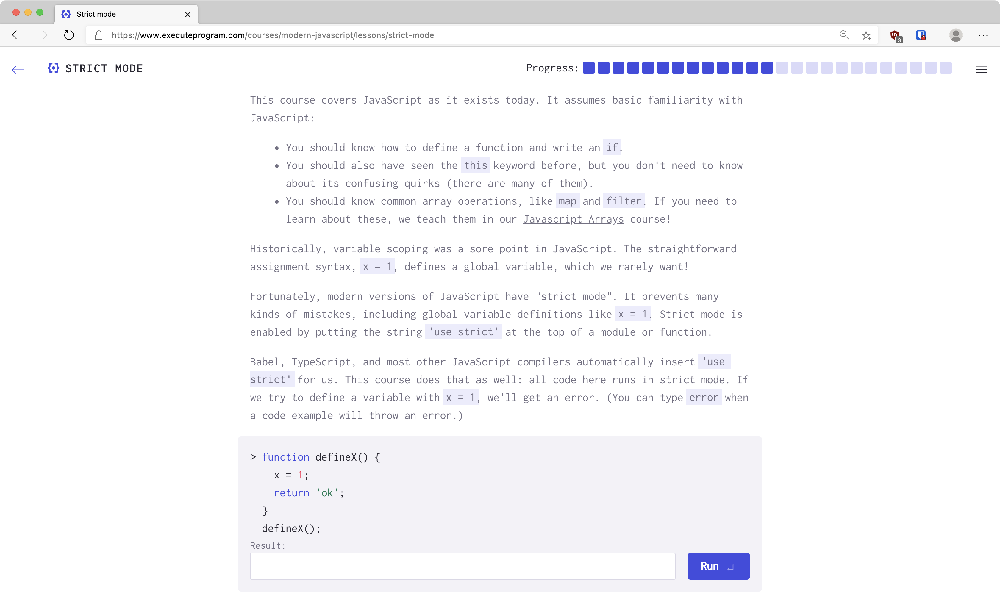

# Pre-apprenticeship

## Wednesday Week 1

---

<!-- {.primary} -->

Welcome to FAC22!

And congratulations!

---

### Agenda

1. Plan for the next 12 weeks
1. Write a personal user manual
1. Installation
1. Pair programming workshop
1. Daily learning and working outside of this programme
1. For next time

---

## Next 12 weeks

---

### Schedule

- **This week:** Introductions
- **Next week:** No workshops
- **Following weeks**: Two workshops each week

Workshops on Wednesdays and Thursdays from 17:00 - 20:00.
We encourage 10+ hours of self-study outside this programme.

---

## Wednesdays

---

Bridging the gap between your application learnings and what you'll need on the course.

---

You're responsible for your own learning outside these sessions. We'll give you a project and some helpful resources each week.

You're welcome to pair up with each other outside our workshops. As always, be mindful to be inclusive.

---

## Thursdays

---

Preparing for interviews with apprenticeship providers. You'll meet employers, follow our employment curriculum, and practice technical interviews together.

---

## Motivation

---

You all have different levels of experience in different areas.

The pre-apprenticeship is designed to ensure everyone starts the course with the coding fundamentals they need.

---

You'll be applying for apprenticeships in less than 12 weeks.

We'll support you to practice for technical interviews and work on your employment profiles.

---

Some of you have more free time than others.

Share your learnings.

Please don't use this to try and get ahead on the curriculum.

---

Remember FAC prioritises collective learning over individual goals.

---

## Expectations

---

You're going to be working together for the first time.

Working effectively in a diverse groups requires work.

---

### Recognise the space you take up.

---

If you're extroverted or loud that's okay.

If you're introverted or quiet that's okay too.

We want everyone to have a voice in our discussions and workshops.

---

The onus should not (only) be on quiet people to make themselves heard.

There's limited time and space in groups, especially on Zoom.

Don't use more than your fair share.

---

Please read our Code of Conduct (again).

foundersandcoders.com/code-of-conduct/

Remember this is _the bare minimum_.

It mostly defines unacceptable behaviour, and it's a low bar!

---

> Prioritise marginalised people’s safety over privileged people’s comfort  
> —paraphrased from afrotechfest.co.uk/coc

---

## Zoom etiquette

---

Please rename yourself to the name you'd like to be called and include your pronouns in brackets.

---

If you have a question or would like to volunteer an answer, raise your hand.

---

Be aware of the space you're taking up on Zoom, only one person can speak at once.

---

## User Manuals

---

It's great to have a space to reflect on ourselves, and how we work in a team.

We can also learn about our team-mates before working together, so we know how to get the best out of each other and work well as a team.

---

Let us know how to say your name; what you'd prefer to be called; and your pronouns.

---

https://namedrop.io/gregorthomson

---

Thinking about:

- How you get your best work done
- The role you take in a team
- How you communicate
- What you value
- What others might misunderstand about you
- How you like to get feedback
- Where you see your technical strengths
- Your interests

---

User manuals (and other GitHub issues) are written in Markdown!

Have a read through [this guide](https://guides.github.com/features/mastering-markdown/) before you get started.

---

Head over to the FAC22 GitHub organisation to get started.

---

## Terminal

---

Allows us to navigate through our file system, install software, use git, and manage databases.

---

Most of us will be familiar with using a Graphical User Interface (GUI), like Finder or Explorer.

---

We'll use the terminal for installing everything we need for the course.

---

## Installation list

---

The first thing to install, if you're on Windows, is the [Windows Subsystem for Linux (WSL)](https://wiki.ubuntu.com/WSL).

---

Once you've installed this, work through the [installation guide](https://learn.foundersandcoders.com/course/handbook/installation/) in small groups.

---

We're around to help, so let us know if you need us!

You might need to restart your computer, we'll keep an eye out for when you rejoin Zoom.

---

## git

---

git is a program for saving the history of changes you make to your files.

---

Saves "snapshots" of your project with descriptive messages.

---

---

Without this its impossible to go back to an old version of a file.

---

Professional code is "version controlled" with git, as are all of your projects on FAC.

---

## GitHub

---

GitHub is a website for backing up and sharing your files.

---

Sync your project from your computer to their website using git.

A bit like Dropbox for your code.

---

---

GitHub is _not_ the same as git (despite the name).

There are other similar sites like Gitlab and Bitbucket.

---

## Using git

---

There are a few ways to use git:

1. git command-line program in your terminal
1. Your editor's git integration
1. GitHub's desktop app

---

### Terminology

- _repository_ (_repo_)  
  a folder whose changes are tracked by git
- _remote_  
  a copy of your repo in the cloud (e.g. on GitHub)

---

### Tracking changes

1. Edit your files
1. "Stage" the changes you want to keep
1. "Commit" those changes with a description

---

### Syncing to remote

1. Create new repo on GitHub
1. Give GitHub repo URL to local git
1. "Push" your local changes to the remote
1. "Pull" remote changes to your computer

---

Throughout the pre-apprenticeship, you'll each maintain a repository on your profile with your learnings from each week.

---

## Pair programming

---

In pairs, work through the [pair programming workshop](https://learn.foundersandcoders.com/course/handbook/pair-programming/).

---

## Daily learning

---

We believe it's important to build a habit of learning

---

The best way to do this is with structured, focused sessions every (working) day

---

### Active problem-solving

Warm up by writing some code before you start the day

(i.e. CodeWars or Execute Program)

---

### Passive learning

Finish the day by reading an interesting article.

Try to take notes as you go to reinforce the learning.

(Dan likes [Anki](https://apps.ankiweb.net/) for turning notes into flashcards)

---

## Execute Program

---

Execute Program is a great place to practice code

---

Interactive courses that force you to cement fundamentals

---

Limited number of lessons per day so you can't burn out

---

### Order

1. From today: Modern JavaScript and Arrays
1. From Week 3: Concurrency
1. From Week 5: SQL and Regular Expressions

---

## What to work on

- Execute Program: Modern JavaScript and Arrays
- Cultivate a daily habit
- Work through [Command Line Primer](https://www.digitalocean.com/community/tutorials/a-linux-command-line-primer)
- Learn about [Semantic HTML](https://learn.foundersandcoders.com/workshops/semantic-html/)
- Create a repository to track your learnings and the websites you're building
