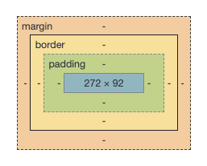

# Pre-apprenticeship

## Wednesday Week 3

---

<!-- {.primary} -->

Welcome back

---

## Programme Structure

---

Each week these workshops will give a brief introduction to the topic for the next two weeks

---

You'll work on a project for each topic, initally on your own and then in pairs

---

- **Weeks 3 & 4:** CSS layouts, architecture and variables
- **Weeks 5 & 6:** Git pairing, code review, estimation, objects and advanced DOM
- **Weeks 7 & 8:** Higher order functions, promises and fetch
- **Weeks 9 & 10:** Testing
- **Weeks 11 & 12:** Final project

---

Along the way, you'll get experience:

- Working with someone else asynchronously
- Estimating how long it will take to build features
- Handling user stories
- Reviewing code

---

## CSS Layouts

---

There are different methods for controlling layouts of web pages

---

- Tables
- Box model
- CSS: Flex box
- CSS: Grid

---

### The box model

---

> As Rachel Andrew has reminded us, everything in web design is a box, or the absence of a box... Layout is inevitably, therefore, the arrangement of boxes.

—<cite>Heydon Pickering & Andy Bell on [Every Layout](https://every-layout.dev/rudiments/boxes/)</cite>

---

---

### CSS Grid

---

A two-dimensional layout composed of **rows** and **columns** separated by **gutters**.

---

  row

  column

<article>👈 gutter 👉</article>
<article></article>
<article></article>
<article></article>  

---

## Demo

---

## Workshop

Work together on [Grid Garden](https://cssgridgarden.com/). Practice some of the pairing techniques from last week.

🏓

_and remember to take a break!_

---

## For next week...

---

Keep working every day and logging your learning on GitHub

---

Deploy your learning site and add the URL to your README

---

Have a look at what others have been up to

Share responsibility and accountability for everyone's learning

---

Work through this week's [project](https://learn.foundersandcoders.com/course/syllabus/pre-apprenticeship-2/project)

---

- Look into ARIA labels and use them in your project where needed
- Work through _Playing with CSS Variables and JS_ && _Array Cardio 1_ on [JavaScript30](https://javascript30.com/)
- Continue with Modern JavaScript and Arrays on Execute Program. Started working on Concurrency.
- Share your learnings on Discord
