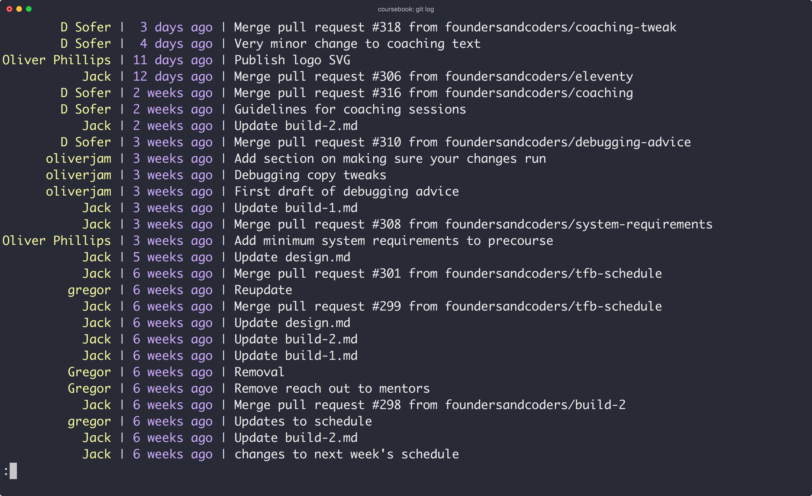
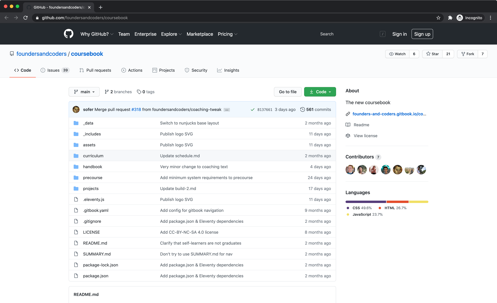

# Intro to git & GitHub

---

## What is git?

---

git is a program for saving the history of changes you make to your files.

---

Saves "snapshots" of your project with descriptive messages.

---

---

Useful if you break stuff, or decide you want to change something back.

---

Without this its impossible to go back to an old version of a file.

---

Professional code is "version controlled" with git, so it's important to learn.

---

## What is GitHub?

---

GitHub is a website for backing up and sharing your files.

---

Sync your project from your computer to their website using git.

A bit like Dropbox for your code.

---

---

GitHub is _not_ the same as git (despite the name).

There are other similar sites like Gitlab and Bitbucket.

---

## Using git

---

There are a few ways to use git:

1. git command-line program in your terminal
1. Your editor's git integration
1. GitHub's desktop app

---

### Terminology

- _repository_ (_repo_)  
  a folder whose changes are tracked by git
- _remote_  
  a copy of your repo in the cloud (e.g. on GitHub)

---

### Tracking changes

1. Edit your files
1. "Stage" the changes you want to keep
1. "Commit" those changes with a description

---

### Syncing to remote

1. Create new repo on GitHub
1. Give GitHub repo URL to local git
1. "Push" your local changes to the remote
1. "Pull" remote changes to your computer

---

If you're just getting started, check out [this workshop](https://learn.foundersandcoders.com/workshops/git-intro/)
