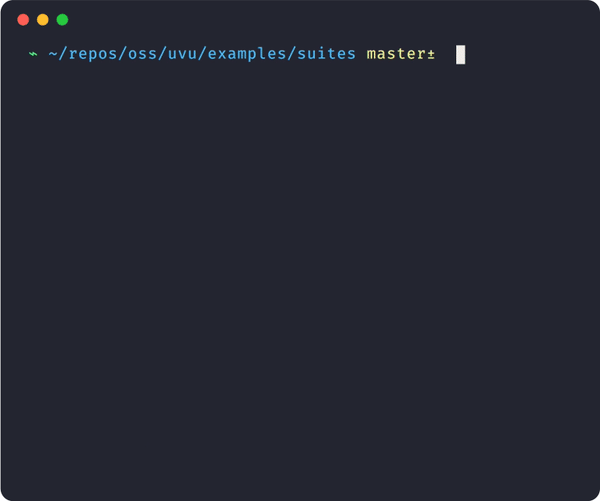
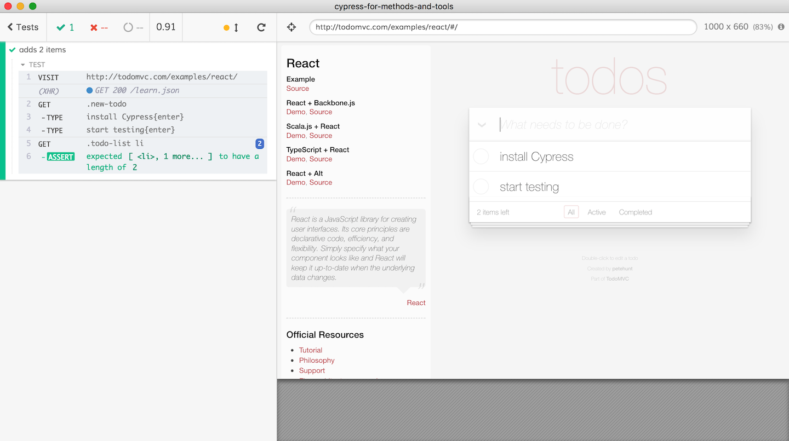

# Testing

---

## Bugs

---

Code will inevitably contain bugs

```javascript
const add = (a, b) => a - b;
```

---

### Real-life bug


Grace Hopper discovered a moth stuck in a Harvard relay in 1947

---

### Missed requirements

Code has _user requirements_. Buggy code doesn't meet those requirements


---

### Bugs

Buggy code frustrates users, loses money, and can have deadly real world effects.

> #### Failure at Dhahran
>
> On February 25, 1991, an Iraqi Scud hit the barracks in Dhahran, Saudi Arabia, killing 28 soldiers from the U.S. Army's 14th Quartermaster Detachment.
>
> A government investigation revealed that the failed intercept at Dhahran had been caused by a **software error** in the system's handling of timestamps.

<!-- {blockquote:.image.screenshot} -->

---

## Preventing bugs

---

### Manual testing

---

We can manually check our code fulfils the user requirements.

---

1. Visit the page
1. Fill out inputs/click buttons
1. Verify it does the right thing

This is time-consuming and error-prone.

---

### Automated testing

---

Code is great for automating repetitive processes.

---

```javascript
const result = add(4, 5);
const expected = 9;

if (result !== expected) {
  console.error("Fail: add(4, 5) should return 9");
}
```

---

### Testing frameworks

---

Can make writings tests a nicer experience:

```js
test("add() works for positive numbers", () => {
  const result = add(4, 5);
  const expected = 9;
  assert.equal(result, expected, "add(4, 5) should return 9");
});
```

---

Can also provide better feedback than just logs:



---

## Different types of testing

---

1. Manual testing (QA)
2. Unit testing
3. Integration testing
4. End-to-end testing

---

### Manual testing

Having a person check a feature works correctly before it goes live.

Companies often employ Quality Assurance engineers for this.

---

### Unit testing

Testing small, simple blocks of code in isolation (like our `add` test above).

---

The easiest kind of test to write.

Usually just "call function, check result is what you expect".

---

However you can have 100% passing unit tests and a broken app.

---

### Integration testing

Testing features made of several units all together.

Often interacting with and checking the real UI.

---

Generally harder to write these tests.

Often involves network requests, the DOM etc.

---

However it gives you a better idea of whether your app really works.

---

### End-to-end testing

Browser automation software lets you test your real site.

It's like automated-manual-testing.

---



---

Usually gives the highest confidence that the real system will work.

---

However can be flaky and slow.

Often limited to testing most important flows.

---

## Why write tests?

---

You always have to test (if you want working code).

Writing automated tests reduces manual work.

---

### Refactoring

_Changing_ code is often harder than writing it  
(especially someone else's code).

Tests can alert us if we broke something.

---

### Problem solving

Some devs find it easier to solve problems by writing tests first  
(like planning an essay)

Helps catch edge-cases you wouldn't have thought of.

---

## Writing good tests

---

### Bug reports

Think of tests as robot QAs.

What would you want a QA to tell you when they found a bug?

---

1. What part of your code failed?
1. What should that code do?
1. What did it do instead?

---

### Edge-cases

Good tests cover edge-cases that are tedious to check manually.

---

1. What if I enter a negative number?
1. What if I submit twice in a row?
1. What if the network request fails?

---

However don't forget to test the "happy path"!

> <cite><strong>Brenan Keller</strong>@brenankeller</cite>
>
> A QA engineer walks into a bar. Orders a beer. Orders 0 beers. Orders 99999999999 beers. Orders a lizard. Orders -1 beers. Orders a ueicbksjdhd.
>
> First real customer walks in and asks where the bathroom is. The bar bursts into flames, killing everyone.

<!-- {blockquote:.image.tweet} -->
