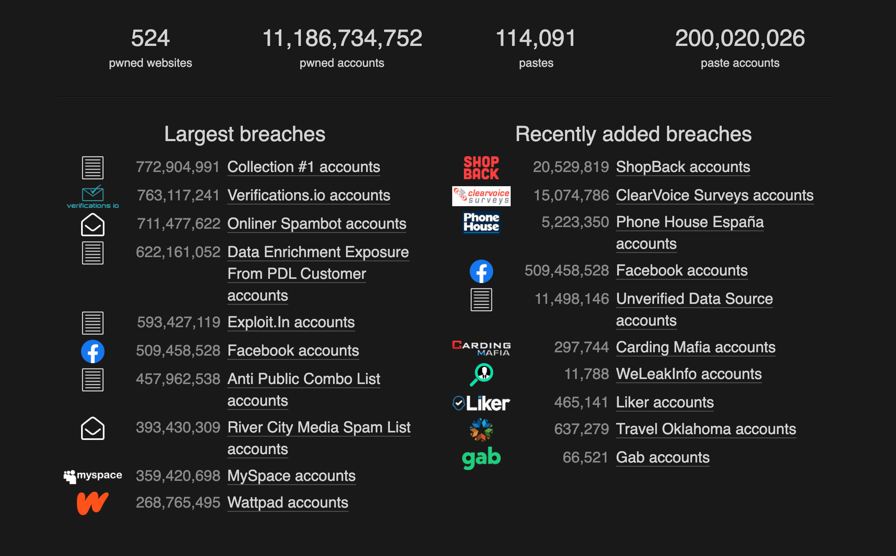

# Web authentication

---

Most websites need a way to verify who is making requests

---

Generally this involves providing some secret only the user could know: often called a password

---

This is fine as a one-off, but websites need to _keep_ users logged in

---

You could ask the user to provide their password on _every_ request.

This would be a terrible user experience though.

---

HTTP is a "stateless" protocol.

This means each request has no knowledge of any others

---

So by itself HTTP has no real way to store information (or "state").

---

"Cookies" were invented in 1994 to maintain state between requests.

E.g. for keeping track of what users add to their shopping carts.

---

## What are cookies really?

---

Cookies are just HTTP headers.

---

If a response contains the `set-cookie` header the browser stores it.

The browser will send this info on all future requests to that domain.

---

E.g. this response sets a cookie containing `test=123`

```
HTTP/1.1 200 Ok
content-type: text/html
set-cookie: test=123

<h1>Hello</h1>
```

---

If the user visits another page (sending a request), the browser automatically adds a `cookie` header.

```
GET /other-page HTTP/1.1
accept: text/html
cookie: test=123
```

---

This allows the server to save info from one request and retrieve it on later requests from the same browser.

---

## Cookie attributes

---

Cookies have attributes to control how they behave

---

### Expiry

---

By default cookies last until the user closes the page. This is known as a "session" cookie.

---

The server can make a cookie last longer by setting the `Max-Age` attribute.

```
set-cookie: test=123; Max-Age=60
```

This cookie will last for 60 seconds.

---

### Security

---

It's important to protect cookies, since they often contain authentication related information

---

The `HttpOnly` attribute prevents JavaScript from accessing the value.

This is important to avoid malicious scripts stealing cookie data (XSS attacks).

```
set-cookie: test=123; Max-Age=60; HttpOnly
```

---

The `Same-Site` option prevents cookies from being sent on requests from other domains.

This is important to avoid other sites impersonating your users (CSRF attacks).

```
set-cookie: test=123; Max-Age=60; HttpOnly; Same-Site=Lax
```

---

The `Secure` option stops the cookie being set on un-encrypted connections.

This is important to stop hackers intercepting requests and stealing cookies (MITM attacks).

```
set-cookie: test=123; Max-Age=60; HttpOnly; Secure; Same-Site=Lax
```

---

## Authentication methods

---

So how do we actually track whether a user is logged in?

---

### Stateless authentication

---

The simplest way is to put all the info you need into cookies.

```
set-cookie: user={"id":"1","name":"oliverjam","role":"admin"}
```

---

The server can read this JSON string and parse it into an object to find out info about which user is logged in.

---

This is called "stateless" as no state is stored on the server.

---

Assuming the server can trust the cookie it can trust this user previously logged in.

---

But can you trust cookies?

---

Cookies are just HTTP headers, so they're easy to fake.

```shell
curl https://example.com -H 'cookie: user={"id":1,"name":"oliverjam","admin":true}'
```

You can even edit them using dev tools.

---

### Signed cookies

---

We can use cryptography to create a value that we can verify later.

---

> Cryptography
>
> The practice and study of techniques for secure communication

---

A "hash function" takes a value and a secret, and returns a "hash".

```js
hash("hello", "secret123");
// "iKqz7ejTrflNJquQ07r9SiCDBww7zOnAFO4EpEOEfAs="
```

---

Hashing is a one-way process. There's no way to get the value back.

---

Hashing the same value with the same secret will always produce the same result.

---

```js
hash("hello", "secret123");
// "iKqz7ejTrflNJquQ07r9SiCDBww7zOnAFO4EpEOEfAs="
```

---

The only way to recreate this value is to know the secret.

---

We can use this to "sign" our cookies.

```
set-cookie: hello.iKqz7ejTrflNJquQ07r9SiCDBww7zOnAFO4EpEOEfAs=
```

---

When the server receives the cookie it can re-hash the value ("hello") using the secret only it knows.

If the hash matches the one in the cookie the server knows it hasn't been tampered with.

---

You won't have to implement this yourself.

It's safer to rely on battle-tested libraries for security features.

---

### Downsides to stateless auth

---

Cookies have a 4kb size limit.

You'll often want to store more user info than that.

---

The server cannot control who is logged in.

If a user presents a non-expired cookie they are authenticated.

---

### Session-based authentication

---

This is the opposite of stateless auth.

Store a single "session ID" in the cookie.

Then use that ID to look up the user data on the server.

---

```
set-cookie: sid=abc123
```

The server reads the cookie, then uses it to look up the saved session data.

This would usually be stored in a database.

---

### Session security

---

Since the session ID is basically a password it must be secure.

---

Session IDs should be long random strings.

This prevents people from guessing them.

---

They should also still be signed with a hash, so you can trust them.

---

## Web security

---

It's important to treat security very seriously.

The web has been plagued by serious breaches.

---



---

As web developers you have a responsibility to safeguard your users' private data.

---

The average user re-uses the same password for most sites.

If you half-ass your site's security and get hacked that has wider repercussions.

---

> Don't roll your own crypto

The golden rule of security

---

If in doubt, look it up.

Find out what is popular and recommended by experts

---

Building a good secure user-experience takes time and effort.

---

Here are some features we haven't covered:

- Email verification
- Password resets
- Preventing automated mass account creation
- Banning abusive accounts

---

If you don't have the time or ability to do it properly (e.g. you're hired for a 2 week freelance project)

use a trusted 3rd party service.
