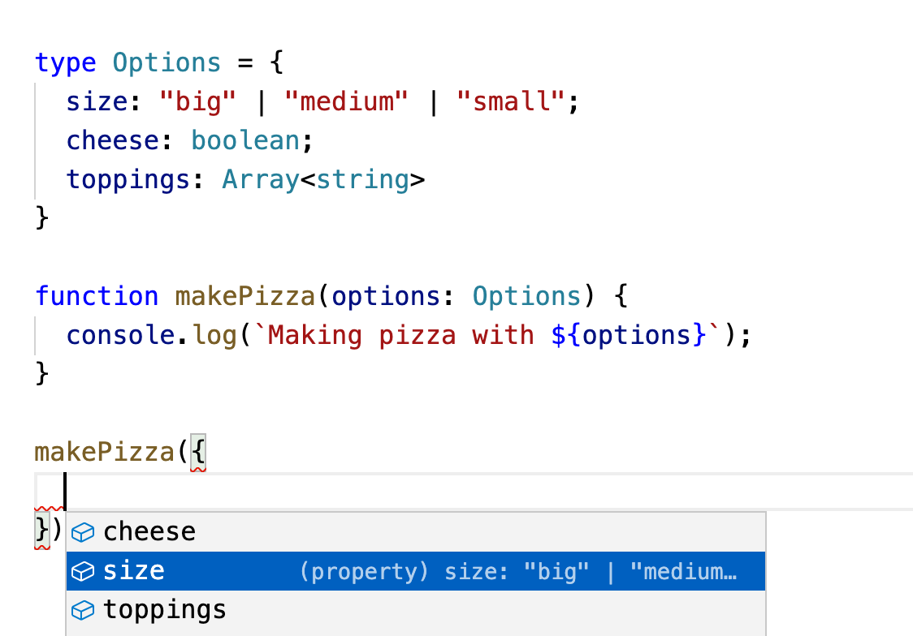

# TypeScript

---

TypeScript is JavaScript plus **static types**

---

It's a _superset_ of JavaScript—valid JS is always valid TS.

TS adds extra stuff on top.

---

It helps you catch errors before your code runs.

Like a linter with more power.

---

## What are types?

---

Programming languages have different _types_ of values.

E.g. a variable can be a string, number, boolean etc.

---

The language must know what each value is to run code correctly.

E.g. it can't multiply two functions together.

---

Some languages (including JS) figure out types when the code runs.

This is known as **dynamic typing**.

---

Other languages figure out types in advance.

This can be in your editor as you write, or during a build/compile.

This is known as **static typing**.

---

TypeScript adds static types to JS.

---

## Why would you want this?

---

Dynamic languages allow devs to quickly write code.

No worrying about edge-cases, subtle bugs etc.

---

This is good for prototyping, but sometimes bad for production code.

---

It's easy to accidentally write code that doesn't always do what you expect.

```js
4 + "20"; // "420"
```

Simple type errors like this seem obvious on their own.

---

Real examples are rarely as easy to notice:

```js
const handleClick = createClickHandler();
window.addEventListener("click", handleClick);

// ...somewhere else
function createClickHandler() {
  const clickHandler = () => console.log("Clicked!");
}
```

Whoops, `handleClick` was `undefined`.

No error, but it doesn't work.

---

In TS you immediately get an error like this:

```
Argument of type 'undefined' is not assignable to parameter of type
  '(this: Window, ev: MouseEvent) => any'
```

---

Static typing can also make writing code nicer.

TS knows what functions expect and can offer helpful suggestions.

---



---

## Types in JS

---

JS has 6 primitive types:

1. Undefined
2. Boolean
3. Number
4. String
5. BigInt (new-ish)
6. Symbol (new-ish)

---

Null is also basically a primitive.

However an early mistake means `typeof null === "object"` 🤷‍♂️

---

Primitives are simple values.

They cannot be altered, have no methods and cannot contain other types.

---

E.g. you cannot make `5` be anything other than `5`

(unlike an array where you can add/remove items).

---

> but primitives have methods! `"hello".includes("h")`

Primitives (except null/undefined) have object wrappers.

JS temporarily wraps them to access methods.

E.g. really you're doing `String("hello").includes("h")`.

---

JS also has "structured" types:

1. Object
2. Function

---

Objects are collections of other values.

All other JS data structures are objects (Array, Map, Set etc).

E.g. an array is an object with ordered number keys:

```js
{ 0: "orange", 1: "banana" };
```

---

Functions are objects that can be "called".

```js
function hi(name) {
  console.log(`Hi ${name}`);
}

hi.length; // 1

hi.blah = "huh?";
console.log(hi.blah); // "huh?"
```

---

## Using TypeScript

---

TS uses `.ts` files to indicate that the content isn't valid JS.

These files must be compiled into regular JS before being run.

---

You can use the TS compiler yourself, or a tool that has TS support.

```shell
tsc src/*.ts
# converts all .ts files in src/ to .js
```

If there are type errors the compiler will tell you.

---

TS can _infer_ types so you don't have to:

```ts
let x = 5;
```

Here TS assigns `x` the `number` type.

---

If we used `const` the result would be different:

```ts
const x = 5;
```

Here TS assigns `x` the `5` type (since it can never change).

---

TS will enforce types:

```ts
let x = 5;
x = "hello";
// Type 'string' is not assignable to type 'number'.

x.includes("hi");
// Property 'includes' does not exist on type 'number'.
```

---

You can use non-JS syntax to define specific types:

```ts
let x: number = 5;
```

(this is often not needed)

---

Objects work the same way:

```ts
const dog = {
  name: "Luna",
  breed: "Cocker Spaniel",
};

// dog: {
//   name: string;
//   breed: string;
// }
```

---

Function parameters are similar:

```ts
function add(x: number, y: number) {
  return x + y;
}

const y = add(1, 2); // TS infers the return type as number

const z = add(4, "20"); // Argument of type 'string' is not assignable to parameter of type 'number'.
```

---

You can specify the return type if it cannot be inferred:

```ts
function add(x: number, y: number): number {
  return x + y;
}
```

---

You can also define your own types:

```ts
type Options = {
  cheese: boolean;
  quantity: number;
}

function makePizza(options: Options) {
  console.log(`Making pizza with ${options}`);
}
```

---

Use a `?` to mark properties as optional:

```ts
type User = {
  name: string;
  age?: number;
}

const me: User = {
  name: "oli"
}

me.age + 5;
// Object is possibly 'undefined'
```

---

Union types can be one of a set of possible values:

```ts
type Status = "pending" | "rejected" | "resolved";

function getMessage(status: Status) {
  switch(status) {
    case "pending": return "Loading...";
    case "rejected": return "Uh oh...";
    case "resolved": return "Finished!";
  }
};
```

---

Generic types are like "type functions".

They take arguments—e.g. here's an array of strings:

```ts
type Ingredients = Array<string>
```

---

You can also define a "tuple"—an array with a fixed length & mixed types:

```ts
type Result = [string, number];
```

---

TS also has some extra types not in JS:

1. any
2. unknown
3. never
4. void

---

"any" basically means "disable type checking".

TS will treat an untyped value it cannot infer as `any`.

You can make "implicit any" an error using a compiler option.

---

"unknown" is a safer version of "any".

It means "no idea what this is, always check the type before using"

---

"never" means "this will never be a value".

E.g. the return type for a function that always throws an error

---

"void" is basically "undefined", but for a function with no return value.

TS thinks it is useful to treat implicit undefineds separately to explicit.

---

## Third party code

---

Your dependencies can include TS type definitions.

This means you'll get extra help when you call functions.

---

Some libraries do not publish their own types.

Instead you can use crowd-sourced ones from "Definitely Typed"

```shell
npm install -D @types/jquery
```

---

### React types

---

You shouldn't need to do much more than provide prop types:

```tsx
import React from "react";

function Greeting(props: { name: string }) {
  return <h1>Hello {props.name}</h1>;
}
```

TS will infer that the return value is a React node.

---

React includes useful types.

E.g. to accept React nodes as props:

```tsx
import React from "react";

function Button({ children }: { children: React.ReactNode }) {
  return <button className="btn">{children}</button>;
}
```

---

It's usually clearer to define the props as a separate type:

```tsx
import React from "react";

type ButtonProps = {
  children: React.ReactNode;
}

function Button({ children }: ButtonProps) {
  return <button className="btn">{children}</button>;
}
```

---

Hooks are inferred based on the initial value:

```tsx
import React from "react";

function Toggler() {
  const [open, setOpen] = React.useState(false);
  // open: boolean
  // setOpen: React.Dispatch<React.SetStateAction<boolean>>
}
```

---

Sometimes you initialise state with a null value.

You can use a union to tell TS what it's going to be:

```tsx
import React from "react";

type UserData = {
  name: string;
  avatar_url: string;
}

function User() {
  const [data, setData] = React.useState<UserData | null>(null);
  // data: UserData | null
}
```

---

## Learning TypeScript

---

The official docs aren't bad.

The handbook is a good intro:

https://www.typescriptlang.org/docs/handbook/intro.html

---

Execute Program is great as always:

https://www.executeprogram.com/courses/typescript

---

Learn the basics then start using it.

You'll get used to googling weird compiler errors

(the messages can be a little cryptic)

---

You'll start to enjoy having a computer tell you why your code's wrong.