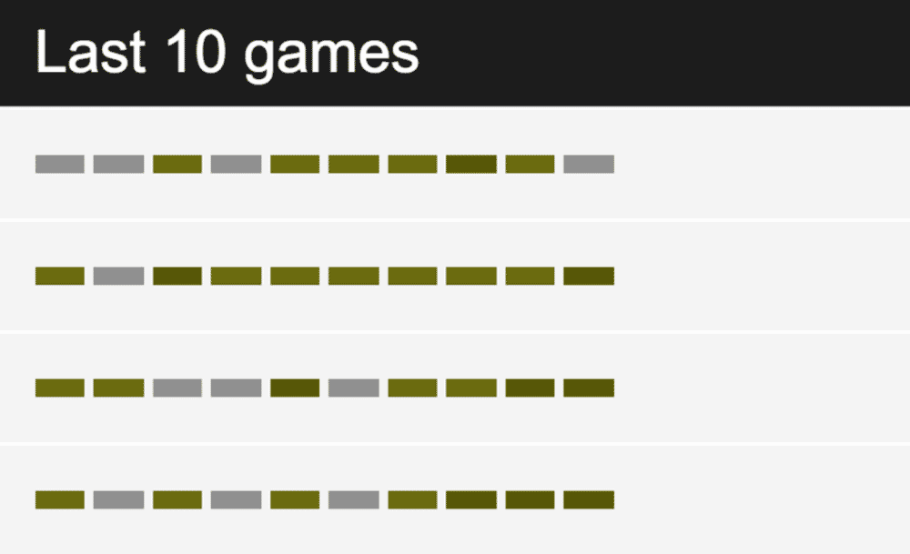
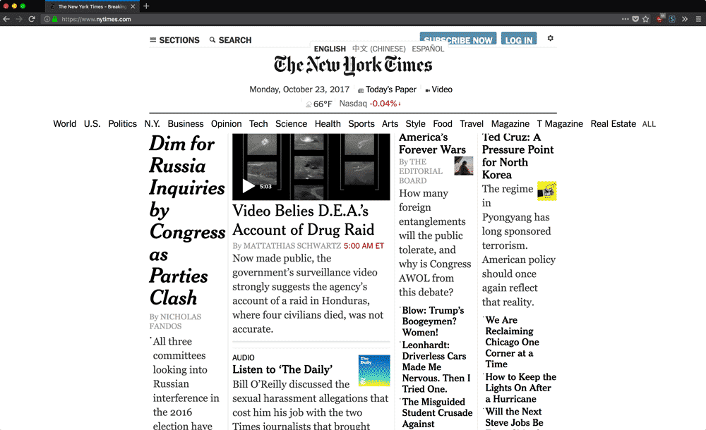
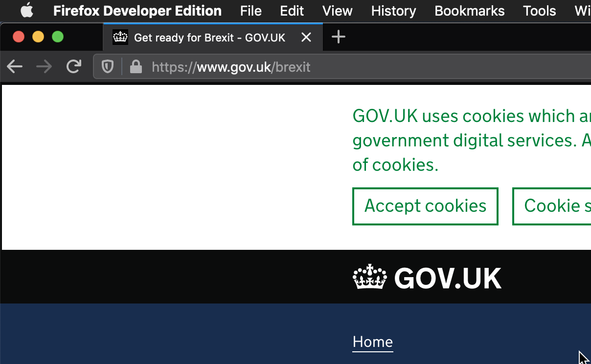

# Accessibility for Everyone

---

## About me

🐦 @\_oliverjam  
🔗 oliverjam.es

💡 FAC10

~~🎟 Ticketmaster~~  
~~🛌 (F)unemployed~~  
Working for FAC!

---

## A brief interlude

---

## The web rules

Imagine a distant past...

---

---

> The web has everything we know on it, and you can read it all. _Nothing's stopping you_. Maybe the fact that that still blows my mind marks me as an old fogey, but honestly, how can that not?

—<cite>[@seldo](http://seldo.com/weblog/2013/09/04/why_i_am_a_web_developer), npm co-founder</cite>

Something _is_ stopping people.

---

Accessibility shouldn't be a special effort

---

Accessibility is a part of UX.

Design for diversity, not disability

---

Good design is inclusive

Inclusive design is good

---

## Accessibility is for everyone

It benefits more people than you might think.

---

### Permanent impairment

4.5% of the population are colour-blind (9% of men)

---

### Permanent impairment

10m people in the UK are disabled (~17% of the population)

Half are over state pension age

---

### Temporary or situational impairment

Everyone benefits from accessible design.

---

#### High contrast

user with poor vision
_or_
me reading my phone in bright sunlight 😎

---

#### Captioned videos

deaf user
_or_
me when I forget my headphones at work 🎧

---

#### One-handed navigation

user with one arm
_or_
me drinking a beer 🍺

---

## Don't make assumptions

Not all users are like you or your teammates

---

Not everyone _always_ has great eyesight.

Not everyone _always_ has a powerful modern device.

Not everyone _always_ chooses the browser they use.

**Design for everyone.**

---

## User personas

---

#### Colour-blind

May struggle to perceive the difference between certain colours.

Do not rely solely on colour

Allow customisation/colour-blind mode

---

---

#### Low-vision

May need to increase the text-size in my browser.

Do not prevent zoom

Scale UI based on font-size

---

---

#### Low-vision

May need to use a screen-magnifier.

Show things in context

Logical content flow

---

---

#### Blind

Need to use a screenreader.

Information isn't solely visual

Programmatic access to structured content

---

<video src="tm-vo.mp4" autoPlay muted loop controls />

---

#### Hard-of-hearing

May struggle to hear things.

Provide text alternatives to audio content

Transcripts and/or subtitles

---

#### Deaf

Cannot hear anything. Sign language may be first language

Subtitles can be hard to follow, may prefer signed content

Option for non-phone communication

---

#### Mild motor-impairment

May struggle to use a mouse or touchscreen with fine control.

Large interactive targets

Lots of padding for links/buttons

---

---

#### Medium motor-impairment

Have to use a keyboard instead of a mouse.

DON'T DISABLE FOCUS OUTLINES

Logical document flow so focus doesn't jump around

Ensure custom UI works without a mouse

---

#### Severe motor-impairment

Uses voice-input instead of a mouse or keyboard.

Test interface with speech-recognition software

Logical labels as they have to describe UI elements

---

#### Dyslexia

May struggle to process written text or spell

Don't require exact spelling

Write content in simple English

Clear subheadings to divide content

---

#### Memory

May struggle to remember previous information or get easily confused.

Don't require memorising info from previous steps

Avoid time-limits for task-completion

---

## How do we design accessibly?

---

### WCAG

The Web Content Accessibility Guidelines are a set of best practices.

To meet guidelines sites should be:

- **P**erceivable
- **O**perable
- **U**nderstandable
- **R**obust

---

### Cheatsheet

The guidelines can be quite dry, so here's a cheatsheet:

[bitsofco.de/the-accessibility-cheatsheet](https://bitsofco.de/the-accessibility-cheatsheet/)

---

#### Perceivable

Can all users perceive your UI?

e.g. text with sufficient size/contrast/line-height, images with alt-text, alerting screenreaders to dynamic content.

---

#### Operable

Can all users operate the UI components and navigation?

e.g. ensure keyboard functionality, no unnecessary time-limits, descriptive link text, hierarchical headings, unique & descriptive page titles.

---

#### Understandable

Can all your users understand the content and how to use the interface?

e.g. use plain English, set the `lang` attribute, label inputs, provide error messages in context.

---

#### Robust

Can your content be understood by different user-agents/assistive tech?

e.g. semantic HTML (and ARIA when this fails you), automated and manual testing.

---

## WAI-ARIA

_Web Accessibility Initiative – Accessible Rich Internet Applications_...

A spec for assigning meaning to meaningless markup.

---

### ARIA gives divs superpowers

Useful where functionality is added with JS

Turns div-soup into something a screenreader can understand.

---

### Labels

Visually obvious content might need a text label.

e.g. `<button aria-label="toggle menu">☰</button>`

---

### Roles

Signifies your custom component as a type assistive tech can recognise.

e.g. a custom `<select>` using divs could use `role="listbox"`.

---

### Live regions

Ensures dynamically updated content is read out.

`aria-live="polite"` will be read once the current info finished

`aria-live="assertive"` will interrupt.

---

## How do we test accessibility?

---

### Manual testing

Actually use your UI!

Unplug your mouse. Try browser extensions that simulate visual conditions.

---

### Automated testing

Chrome Lighthouse, pa11y, aXe.

---

## Live coding time

---

## Resources

- [Mozilla's introduction to <abbr>ARIA</abbr>](https://developer.mozilla.org/en-US/docs/Learn/Accessibility/WAI-ARIA_basics)
- [Tutorials for building real components](https://inclusive-components.design/)
- [An overview of <abbr>WCAG</abbr>](https://bitsofco.de/the-accessibility-cheatsheet/)
- [Goverment Digital Services' accessibility blog](https://accessibility.blog.gov.uk/)
- [Microsoft's inclusive design guidelines](https://www.microsoft.com/design/inclusive/)

---

# Thanks 🔥

🐦 Twitter: @\_oliverjam | 🐙 Github: @oliverjam | 🌐 Web: oliverjam.es
